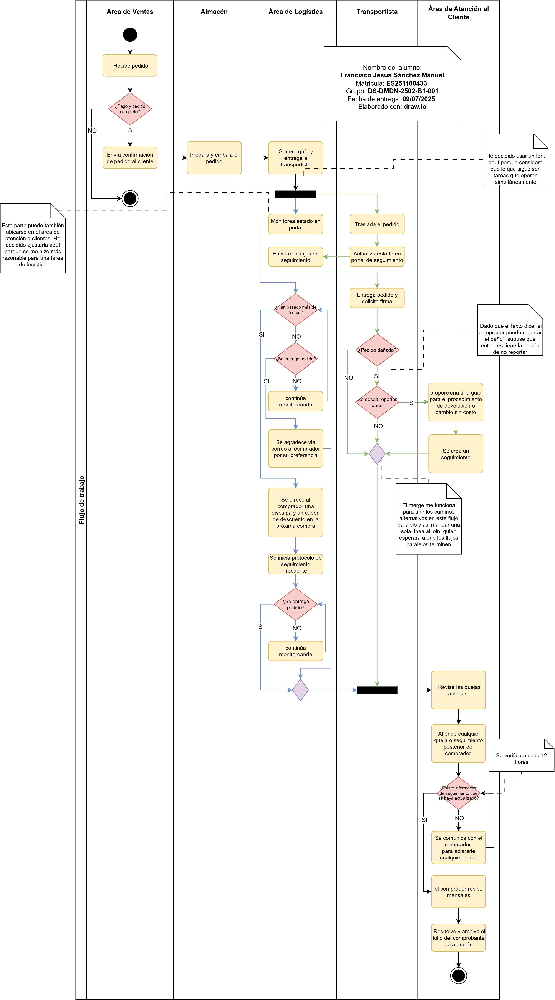

# 📊 Diagrama de Proceso de Negocio: SportZone

Este repositorio contiene un diagrama de actividades **UML** que modela el proceso de **"Seguimiento de Envíos"** para la empresa ficticia "SportZone". El diagrama fue desarrollado como parte de la Evidencia de Aprendizaje de la Unidad 1 para la asignatura de **Modelado de Negocios**.

El objetivo del modelo es representar visualmente el flujo de trabajo actual, identificar los actores involucrados, los cuellos de botella y las ineficiencias en la comunicación para proponer mejoras estratégicas.

---

## 🖼️ Vista Previa del Diagrama

---

## 📂 Cómo Abrir y Editar el Archivo

El diagrama fuente se encuentra en el archivo: `DMDN_U1_EA.drawio`.

Para visualizar y editar el diagrama, puedes utilizar uno de los siguientes métodos:

#### 🌐 **Método 1: Editor Web (Recomendado)**

1.  **Descarga** el archivo `DMDN_U1_EA.drawio` de este repositorio.
2.  Abre la página oficial del editor: **[app.diagrams.net](https://app.diagrams.net/)**.
3.  **Arrastra y suelta** el archivo descargado directamente sobre la ventana del editor.

#### 🖥️ **Método 2: Aplicación de Escritorio**

1.  Asegúrate de tener instalada la aplicación de escritorio de **draw.io**.
2.  **Descarga** el archivo `DMDN_U1_EA.drawio`.
3.  Abre el archivo con la aplicación.

---

## 🛠️ Herramientas Utilizadas

* **Lenguaje de Modelado:** UML 2.5
* **Software de Diagramación:** draw.io (diagrams.net)

---

## 👨‍💻 Autor

* Francisco Jesús Sánchez Manuel
