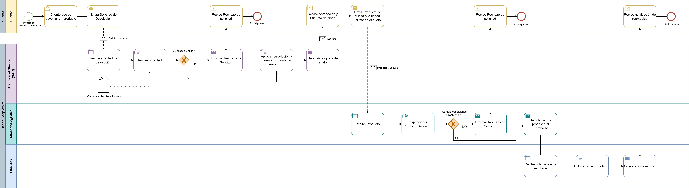

# 📊 Diagrama de Proceso de Negocio: Tienda Gary White

Este repositorio contiene un diagrama de procesos de negocio que utiliza la notación **BPMN 2.0** para modelar el flujo de **"Devolución y Reembolso"** de la tienda en línea ficticia "Gary White". El diagrama fue desarrollado como parte de la Actividad 3 de la Unidad 2 para la asignatura de **Modelado de Negocios**.

El objetivo del modelo es representar visualmente el proceso de manera clara y sin ambigüedades, identificando los participantes (Pools), los roles internos (Lanes) y el flujo exacto de tareas, mensajes y decisiones.

---

## 🖼️ Vista Previa del Diagrama

---

## 📂 Cómo Abrir y Editar el Archivo

El diagrama fuente se encuentra en el archivo: `DMDN_U2_A3.drawio`.

Para visualizar y editar el diagrama, puedes utilizar uno de los siguientes métodos:

#### 🌐 **Método 1: Editor Web (Recomendado)**

1.  **Descarga** el archivo `DMDN_U2_A3.drawio` de este repositorio.
2.  Abre la página oficial del editor: **[app.diagrams.net](https://app.diagrams.net/)**.
3.  **Arrastra y suelta** el archivo descargado directamente sobre la ventana del editor.

#### 🖥️ **Método 2: Aplicación de Escritorio**

1.  Asegúrate de tener instalada la aplicación de escritorio de **draw.io**.
2.  **Descarga** el archivo `DMDN_U2_A3.drawio`.
3.  Abre el archivo con la aplicación.

---

## 🛠️ Herramientas Utilizadas

* **Lenguaje de Modelado:** BPMN 2.0
* **Software de Diagramación:** draw.io (diagrams.net)

---

## 👨‍💻 Autor

* Francisco Jesús Sánchez Manuel
