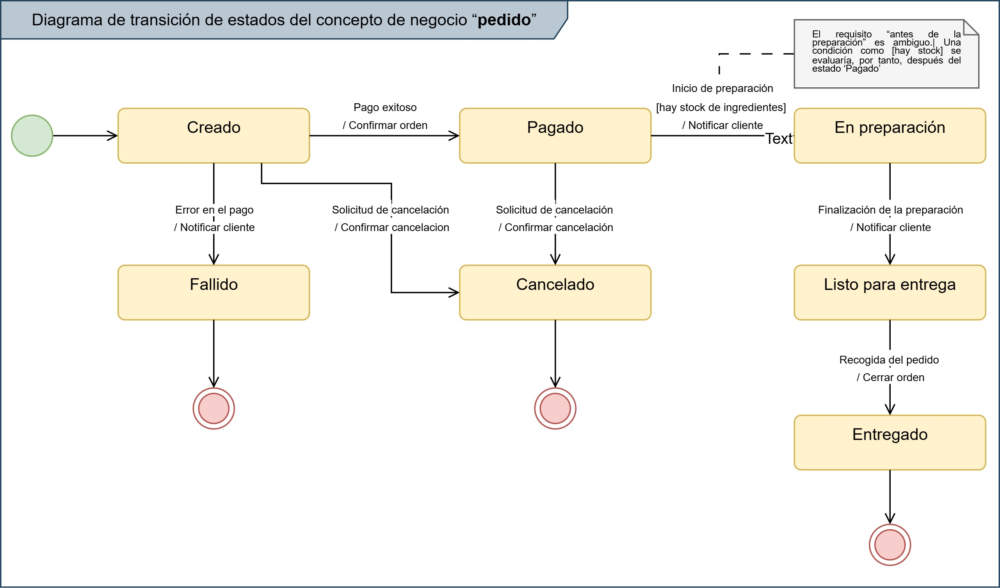

#  Evidencia de Aprendizaje: Diagrama de Transición de Estados (UML) ☕

---

## 📖 Sobre el Proyecto

El objetivo de este proyecto es aplicar los principios del Lenguaje Unificado de Modelado (UML) para analizar y representar el comportamiento dinámico de un concepto de negocio. Específicamente, se modela el ciclo de vida completo de un "Pedido" dentro de un sistema de gestión para una cafetería, utilizando un **Diagrama de Transición de Estados**.

Este modelo visual sirve como una herramienta fundamental para analistas, desarrolladores y stakeholders, asegurando un entendimiento común y preciso de las reglas de negocio que gobiernan el proceso.

---

## 🖼️ Vista Previa del Diagrama

A continuación se muestra una vista previa del diagrama de estados final.

---

## ☕ Caso de Estudio: "Pedidos Express"

El modelo se basa en el caso de estudio "Pedidos Express", una cafetería moderna que gestiona órdenes a través de una aplicación móvil y en su local. El valor agregado del negocio es la **rapidez y la trazabilidad del pedido en tiempo real**, notificando al cliente sobre cada cambio de estado.

---

## 📊 Análisis del Modelo

El diagrama modela el ciclo de vida del objeto `Pedido`, desde su creación hasta su conclusión exitosa o excepcional.

### Estados Principales
El modelo define los siguientes estados por los que puede transitar un pedido:
* `Creado`
* `Pagado`
* `En preparación`
* `Listo para entregar`
* `Entregado` (Estado final de éxito)
* `Cancelado` (Estado final de excepción)
* `Fallido` (Estado final de excepción)

### Lógica de Negocio Clave
Se modelaron reglas de negocio cruciales para asegurar la robustez del sistema:
* **Doble Causa de Cancelación:** Un pedido puede ser cancelado por solicitud del cliente o por una causa interna del negocio (falta de stock).
* **Condiciones de Guarda:** Se utiliza una condición de guarda `[hay stock]` para verificar la disponibilidad de ingredientes antes de que un pedido pagado entre en preparación, dirigiendo el flujo al estado `Cancelado` si la condición no se cumple.

---

## 🛠️ Herramientas Utilizadas

* **Diagramación:** [Draw.io](https://app.diagrams.net/) (diagrams.net)
* **Estándar:** UML 2.5.1 (Máquinas de Estado)

---

## 👨‍💻 Autor

* **Francisco Sánchez Manuel**